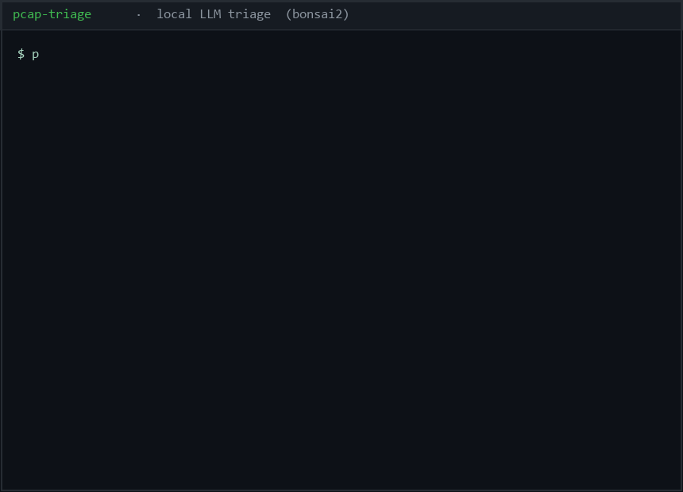

# pcap-triage

[](https://github.com/valelolol/pcap-triage/actions/workflows/ci)

**Autonomous network-capture triage with a local LLM.**



`pcap-triage` ingests a packet capture (pcap / pcapng), turns it into
*flows* and *deterministic signals*, and asks a **local** LLM (zero external
API) to explain each flow in plain language and recommend an action. The
deterministic layer is fully reproducible and unit-testable; the model is a
swappable *explainer*.

## What it detects (per flow, on a 5-tuple)

| Signal | How | Why |
|--------|-----|-----|
| **Beaconing** | coefficient of variation of inter-packet intervals | C2 beacons are precisely-timed (low jitter); human web traffic is not |
| **Entropy** | Shannon entropy of payload bytes | high entropy ⇒ encrypted exfil / C2 channel |
| **Rare / suspicious ports** | well-known vs. non-standard port lists | non-standard ports are common C2/exfil |
| **TLS fingerprint (JA3)** + SNI | parse TLS ClientHello | correlate infra / cert |
| **Domains** | DNS queries + SNI + loose regex | rare / lookalike domains |

## Why zero dependencies

The whole project ships with **stdlib only** (`struct`, `json`, `urllib`, `statistics`, `re`, `hashlib`). It runs on Windows, Kali, the model VM, or any Linux box — no `scapy`, no `tshark`, no PyPI install. That's a deliberate, testable choice: a pure-stdlib pcap reader/writer is itself a real contribution.

## How it runs end to end

```
pcap/pcapng file
    │  pcap_reader.py  (classic + pcapng, stdlib)
    ▼
(raw frames, timestamps)
    │  pkt.py  (Ethernet→IPv4→TCP/UDP; JA3; SNI; Shannon entropy)
    ▼
    │  triage.py  (group into 5-tuple flows; compute deterministic signals)
    ▼
 signals (per-flow dicts: IAT, entropy, beacon score, port flags, JA3, SNI, domains)
    │  model.py  (POST /v1/chat/completions → local LLM on the model VM)
    ▼
 plain-English incident summary + recommended action   (or deterministic fallback)
```

The model is called over the **OpenAI-compatible** API on the model VM
(`http://100.86.193.106:8090/v1`, model `bonsai2`, no auth, 65k context,
~48 tok/s). If that server is unreachable, `model.py` falls back to a
**deterministic note** so triage is always usable offline.

## Install

```
pip install pytest          # only for the test harness
```
Nothing else. `main.py` runs with the stdlib.

## Usage

```
python main.py capture.pcap                 # parse + local-LLM analysis
python main.py capture.pcap --no-model      # deterministic notes only (offline)
python main.py capture.pcap --json          # signals as JSON
python main.py capture.pcap --top 10        # top-N flows by packet count
```

### Pointing at a model

```
PCAP_TRIAGE_MODEL_HOST=http://100.86.193.106:8090/v1   # llama.cpp llama-server
PCAP_TRIAGE_MODEL=bonsai2
PCAP_TRIAGE_TIMEOUT=300
```

## Test harness

Eight tests, no network, ground-truth synthetic captures (C2 beacon,
high-entropy exfil, benign irregular web):

```
$ python -m pytest tests/ -v
test_reader_roundtrip          PASSED
test_c2_beacon_detected        PASSED
test_exfil_high_entropy        PASSED
test_benign_not_flagged        PASSED     # irregular web must NOT trip beacon
test_flow_fields               PASSED
test_multiple_flows            PASSED
test_empty_pcap                PASSED
test_entropy_values            PASSED
============================== 8 passed =============================
```

## Example output (real, from a 43-packet combined capture)

```
================================================================
pcap-triage  —  autonomous network capture triage
================================================================
capture: 43 packets parsed in 0.00s
flows: 3 distinct 5-tuple flows

## Model analysis (local LLM)
----------------------------------------------------------------
**Flow 1 (10.0.0.9 → 185.220.101.43:4444):**
This is a low-volume, perfectly periodic (45 s, σ=0) connection to a
well-known reverse-shell port (4444) with no TLS, no return traffic, and a
beacon score of 0.9 — almost certainly a C2 beacon.
**Recommended action:** Isolate 10.0.0.9 immediately and capture the full
session for IOC extraction.

## Deterministic signals
----------------------------------------------------------------
[BEACON, SUSP_PORT] 10.0.0.9:45220 -> 185.220.101.43:4444 (tcp, 20 pkts, 180 B)
    IAT=45.0s/0.0s entropy=3.16 beacon=0.9
[BEACON, HIGH_ENTROPY] 10.0.0.14:51300 -> 209.12.23.111:80 (tcp, 15 pkts, 3840 B)
    IAT=0.5s/0.0s entropy=7.19 beacon=0.9
[RARE_DOM] 10.0.0.14:51301 -> 142.250.180.206:443 (tcp, 8 pkts, 296 B)
    IAT=20.143s/16.507s entropy=4.32 beacon=0.0
    domains=example.com
```

## Files

| File | Role |
|------|------|
| `pcap_reader.py` | stdlib pcap / pcapng reader |
| `pcap_writer.py` | stdlib pcap writer (synthesizes captures for the harness) |
| `pkt.py` | Ethernet→IPv4→TCP/UDP parse, JA3/JA3S, SNI, Shannon entropy |
| `triage.py` | 5-tuple flow grouping + deterministic signal computation |
| `model.py` | local-LLM client + deterministic fallback |
| `main.py` | CLI entrypoint |
| `tests/` | pytest harness + synthetic ground-truth captures |
